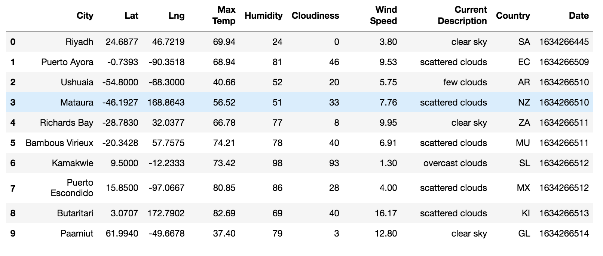
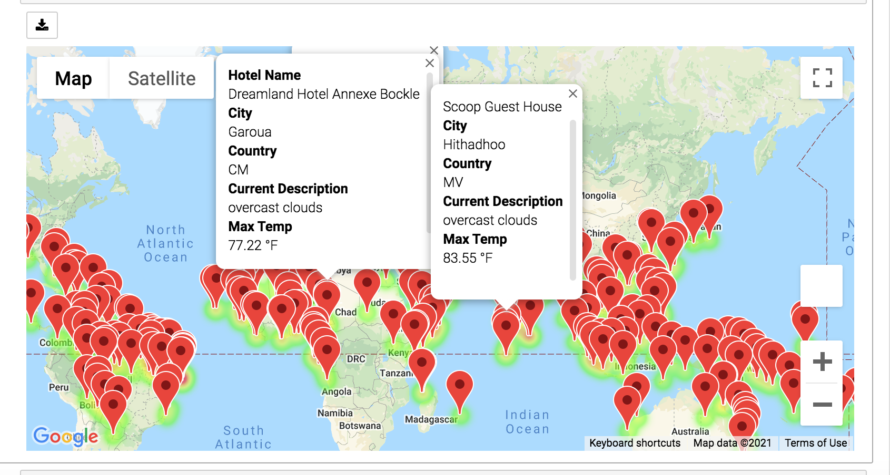
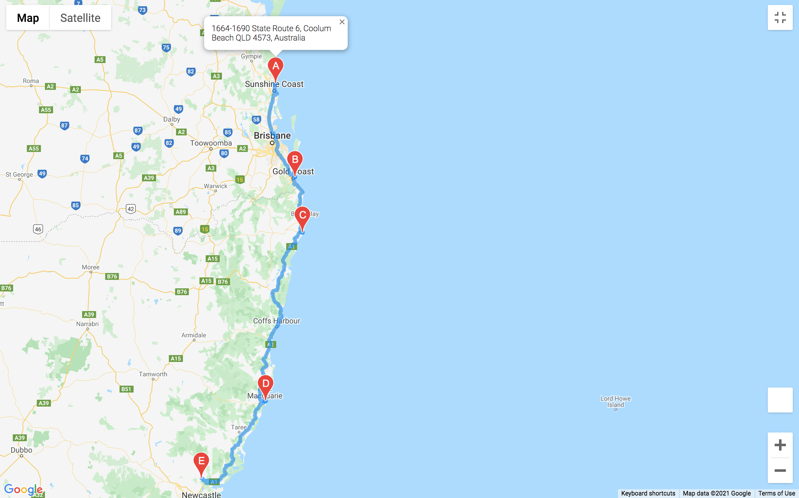

# World Weather Analysis

## Project Overview 
The objective of this project is to collect, analyze, and visualize the world's cities weather data and use that information to help client's plan their next vacation. This data will recommend hotels to those seeking travel based on their weather preferences. The project will accomplish 3 taks: retrieve weather data, create a travel destinations map, and create a travel itinerary map. To complete this analysis, we will retrieve data from OpenWeatherMap and Google Maps using an API. Our statistically analysis will be done using Citipy.

## Analysis
### Retrieve Weather Data:
We first generated a set of 2,0000 random coordinates. After which we used an API call with the OpenWeatherMap to collect the current weather for each city and loaded this information into a data frame. 

### Create Travel Destinations Map:
For this part of the analysis, we used the client's weather preferneces to collect potential travel destinations as well as nearby hotels. This was then displayed using a map with pop-up markers. 

### Create Travel Intinerary Map:
Lastly, we used an API with Google Directions to create a vacation itinerary route for the travel between 4 cities. Along with directions, a map was added that displayed information for each city: city name, recommended hotel, current weather description, and max temperature. 

